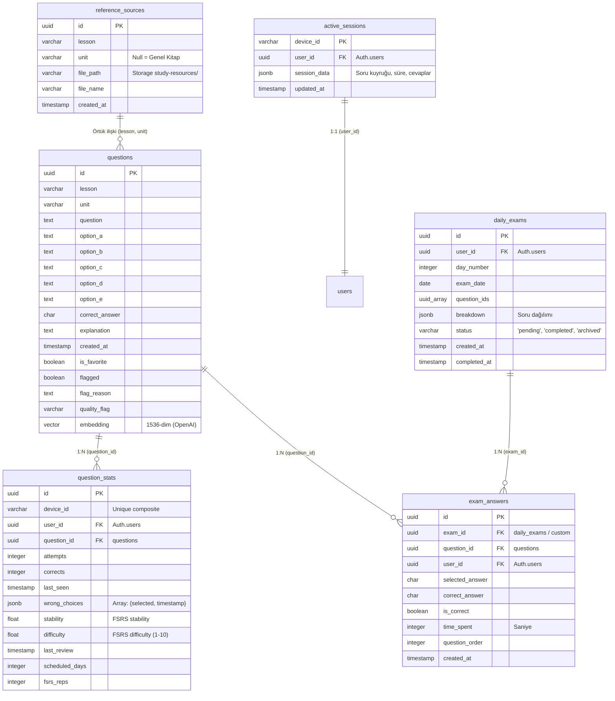

Bu dosya projenin teknik yapısını ve hiyerarşisini açıklamak amacıyla oluşturulmuştur ve her yapılan değişiklik sonrası ilgili kısım güncel versiyon ile güncellenir, built alınır ve deploy edilir.

# DUSBANKASI — Teknik Mimarisi & Kod Hiyerarşisi (v3.0)

Bu belge, DUSBANKASI projesinin tüm kod yapısını, veri tabanı şemasını, algoritmalarını ve veri akışlarını içeren bağlayıcı tek teknik kılavuzdur. LLM ve PAI ajanlarının sistemi sıfır hata ile anlaması, debug etmesi ve genişletmesi için tasarlanmıştır.

---

## 1. GENEL MİMARİ VE BİLEŞEN HİYERARŞİSİ

Proje, **React 19 + TypeScript + Vite 8 + Tailwind CSS 4** tabanlı bir frontend istemcisi ve **Supabase (PostgreSQL + pgvector)** tabanlı bir sunucusuz (serverless) backend mimarisinden oluşur. Soru üretimi ve veri kalitesi güvencesi (QA) ise **Python 3.12 + Google NotebookLM API + OpenAI Embeddings** tabanlı bir veri hattı ile sağlanır.

### Kuşbakışı Dizin Haritası

```
DUSBANKASI/
├── public/                 # Statik varlıklar (resimler vb.)
├── raporlar/               # smart_audit_pipeline.py tarafından üretilen kopya raporları
├── scripts/                # Soru üretim ve kürasyon veri hattı (Python)
│   ├── tools/              # Kalite denetimi, embedding backfill ve veri kurtarma araçları
│   ├── config.py           # Python scriptlerinin konfigürasyon dosyası
│   ├── notebooklm-exhaust.py # Çapa=Soru tabanlı ana üretim motoru
│   └── shared.py           # Kalite filtreleri, JSON kurtarma ve DB yardımcıları
├── src/                    # Frontend uygulama kaynak kodları (React + TS)
│   ├── components/         # Arayüz bileşenleri
│   │   ├── ai/             # AI Asistan paneli
│   │   ├── quiz/           # Soru çözme ve quiz yönetim arayüzleri
│   │   ├── DailyPlanView.tsx # Günlük adaptif çalışma planı ve FSRS metrikleri
│   │   ├── ErrorAnalyticsView.tsx # Hata sıklığı ve zayıf ünite analizi
│   │   ├── SimulationResultView.tsx # Sınav simülasyonu sonuç ekranı
│   │   └── SourceBooksView.tsx # AI referans PDF kitapları yönetim arayüzü
│   ├── config/             # Uygulama varsayılan ayarları (FSRS ve adaptif ağırlıklar)
│   ├── hooks/              # Optimizasyon ve veri yönetim sarmalayıcıları (hooks)
│   ├── lib/                # Temel algoritmalar ve API istemcileri
│   │   ├── adaptive.ts     # Sinyal birleştirme, interleaving ve havuz planlama motoru
│   │   ├── ai.ts           # Gemini / DeepSeek API entegrasyon katmanı
│   │   ├── fsrs.ts         # FSRS-5 (Spaced Repetition) matematiksel motoru
│   │   └── supabase.ts     # Supabase istemcisi, recursive fetching ve cloud sync
│   ├── types/              # Evrensel TypeScript veri tipleri
│   ├── App.tsx             # Ana uygulama durum makinesi (State Machine)
│   ├── index.css           # Tailwind CSS 4 giriş noktası
│   └── main.tsx            # React 19 başlatıcı script
├── supabase-schema.sql     # Supabase ana veri tabanı tabloları ve RLS şeması
├── migration-v2-auth.sql   # Supabase Auth entegrasyonu ve pg_cron görevleri
├── package.json            # Bağımlılıklar ve npm scriptleri
├── tsconfig.json           # TypeScript derleyici konfigürasyonu
└── vite.config.ts          # Vite derleme ayarları
```

---

## 2. VERİTABANI ŞEMASI VE İLİŞKİSEL MİMARİ

Supabase PostgreSQL üzerinde koşan şema, öğrenim durumu takibi ve soru yönetimi için tasarlanmıştır.



### Kritik Alan Açıklamaları ve Kısıtlamalar

1. **`questions.quality_flag`**: Kalite denetiminden geçen veya kalan soruları işaretler.
   - `null` veya `'reviewed_keep'`: Çalışma havuzuna dahil edilir.
   - `'kavramsal_kopya'`: Post-production LSH denetiminde kopya bulunan sorulardır. Client-side filtre ile anında gizlenir.
   - `'auto_deleted'`: Her Pazar koşan `pg_cron` ile kalıcı olarak silinmek üzere bekletilen kayıtlar.
2. **`question_stats` Composite Unique Key**:
   - Tabloda `device_id` ve `question_id` üzerinde `UNIQUE` constraint vardır.
   - **Kritik Fix (v2.0)**: Eski şemada `user_id, question_id` üzerinden yapılan kısıt, anonim çalışan cihazların veri senkronizasyonunu bozuyordu. Artık her veri her zaman `device_id` ile yazılır, kullanıcı giriş yaptığında `user_id` alanı doldurulur ve bulut üzerinden cihaz bağımsız senkronizasyon tetiklenir.
   - **Kritik Fix (v3.1) — `user_id` Ezme Yarışı**: `pushStatsToCloud` (`src/lib/supabase.ts`) artık `user_id`'yi yalnızca giriş yapılmışsa payload'a ekler. `userId` yoksa alan tamamen dışarıda bırakılır; PostgREST `merge-duplicates` conflict update'inde sadece gönderilen sütunları yazdığı için mevcut `user_id` korunur. Aksi halde auth çözülmeden çalışan debounced sync, mevcut kayıtların `user_id`'sini `null`'a ezerek giriş yapan kullanıcının istatistiklerini yetim bırakıyordu. Regresyon testi: `src/lib/__tests__/supabase.test.ts`.

---

## 3. ALGORİTMALAR VE CORE KÜTÜPHANELER

### 3.1. FSRS-5 Core Motoru (`src/lib/fsrs.ts`)

**Free Spaced Repetition Scheduler v5** algoritması, hafıza gücünü (stability) ve konunun zorluğunu (difficulty) power-law forgetting curve modeli kullanarak günceller. 

#### Matematiksel Formülasyonlar
* **Unutma Eğrisi (Retrievability - Geri Çağrılabilirlik)**:
  $$R(t, S) = \left(1 + \frac{19}{81} \cdot \frac{t}{S}\right)^{-0.5}$$
  Burada $t$, son çözme işleminden bu yana geçen gün sayısıdır. $S$ ise hafıza stabilitesidir.
* **Sonraki Tekrar Aralığı (Next Interval)**:
  $$I(S, R_{target}) = \frac{S}{19/81} \cdot \left(R_{target}^{-2} - 1\right)$$
  Varsayılan hedef hatırlama oranı ($R_{target}$) **%90 (%0.90)** olarak kalibre edilmiştir.

#### Kod Akış Yapısı
* **`initCard(grade)`**: Hiç çözülmemiş bir soru sisteme dahil edilirken $W$ ağırlıklarına göre $S$ ve $D$ başlangıç değerlerini atar:
  - $stability = W[grade - 1]$
  - $difficulty = W[4] - e^{W[5] \cdot (grade - 1)} + 1$ (1-10 arası sınırlanır)
* **`reviewCard(card, grade)`**:
  - `Again` (grade=1): Yanlış cevap durumudur. Hatırlama oranı ($R$) hesaplanır. Yeni zorluk seviyesi artırılır. Stability değeri lapse formülü ile düşürülür:
    $$S_{new} = W[11] \cdot D^{-W[12]} \cdot \left((S+1)^{W[13]} - 1\right) \cdot e^{(1-R) \cdot W[14]}$$
  - `Good` (grade=3): Doğru cevap durumudur. Stability recall formülü ile büyütülür:
    $$S_{new} = S \cdot \left(1 + e^{W[8]} \cdot (11-D) \cdot S^{-W[9]} \cdot \left(e^{(1-R) \cdot W[10]} - 1\right)\right)$$
  - Elde edilen stabilite değeri $[0.1 \text{ gün}, 365 \text{ gün}]$ aralığında tutulur (`FSRS_MAX_STABILITY_DAYS`).
* **`migrateSM2Card`**: SuperMemo-2 parametrelerini (`easeFactor`, `interval`, `repetitions`) FSRS-5 formatına dönüştürür.
  - $EaseFactor \in [1.3, 2.5] \rightarrow Difficulty \in [10, 1]$ ters lineer eşlemesi yapılır.
  - $Stability \approx Interval$ olarak kabul edilerek veri kaybı olmadan geçiş sağlanır.

---

### 3.2. Adaptif Soru Seçim Motoru (`src/lib/adaptive.ts`)

Uygulamanın kalbi olan adaptif motor, soru havuzundan adayları seçerken 3 farklı sinyali birleştirerek bir öncelik kuyruğu (Priority Queue) oluşturur.

```
Sinyal 1: FSRS Urgency  ───► [ log(overdueDays) / log(30) ] ───┐
                                                               ├─► Ağırlıklı Toplam ─► + Jitter ─► Smart Queue
Sinyal 2: Weakness Score ──► [ (1-Accuracy)*0.7 + Wrong*0.3 ] ─┘
```

#### Öncelik Skoru (Priority Score) Hesaplama Formülü
Bir $q$ sorusu için toplam $Priority$ skoru $[0, 1]$ aralığına normalize edilir:
$$Priority = \text{Clamp}\Big(W_{urgency} \cdot Urgency(q) + W_{weakness} \cdot Weakness(q), 0, 1\right) + \text{Jitter}$$
* **$Urgency(q)$**:
  $$Urgency = \frac{\ln(1 + \text{OverdueDays})}{\ln(1 + 30)}$$
  Eğer kartın vadesi bugün veya geçmişte gelmediyse $Urgency = 0$'dır. Logaritmik yumuşatma sayesinde gecikme süresi 30 günü aşan kartların öncelik patlaması yapması engellenir.
* **$Weakness(q)$**:
  $$Weakness = (1 - \text{CorrectRate}) \cdot 0.7 + \min\left(1, \frac{\text{WrongChoicesCount}}{10}\right) \cdot 0.3$$
  Çözülme geçmişinde sıkça yapılan yanlış seçimler weakness skorunu doğrudan yukarı taşır.
* **$Jitter$**: `Math.random() * 0.02` ile eklenen küçük gürültü. Aynı skora sahip soruların ardışık sıralanmasını engeller.
* **Ağırlık Kalibrasyonu**: `fsrsUrgency: 0.50`, `weakness: 0.35`, `newExploration: 0.15` varsayılan değerlerdir ve çalışma fazına göre `setAdaptiveWeights` ile runtime'da güncellenebilir.

#### Greedy Interleaving Algoritması
Rohrer & Taylor (2007) teorisine dayanan interleaving, ardışık gelen iki sorunun aynı dersten olmamasını hedefler.
1. Havuzdaki tüm sorular $Priority$ değerine göre büyükten küçüğe sıralanır.
2. Bir önceki seçilen sorunun dersi ($lastLesson$) hafızada tutulur.
3. Kalan listeden $lesson \neq lastLesson$ kuralına uyan en yüksek öncelikli soru seçilir (`sorted.findIndex(...)`).
4. Eğer listede farklı dersten soru kalmadıysa, en baştaki (aynı dersten olsa dahi) soru çekilerek havuz tamamlanır.

#### Soru Havuzu Kurucu Yardımcıları
* **`buildUnitQueue`**: Tek bir ünite bazında unseen (görülmemiş) soruları öne alır. Her bir grubu kendi içinde `fisherYates` algoritması ile karıştırır.
* **`buildSimulationPool`**: DUS simülasyonu için her dersten tam eşit sayıda soru seçer. Görülmemiş sorulara 2 kat ağırlık verir ve en son tüm listeyi global olarak karıştırır.
* **`buildDailyExam`**: Günün denemesi için **%80 hiç görülmemiş (New)** ve **%20 zor/orta/kolay (Review)** oranını hedefler. Review sorularında öncelik sırası `hard -> medium -> easy` şeklindedir.

---

### 3.3. Supabase Entegrasyonu ve Performans Filtresi (`src/lib/supabase.ts`)

10.000+ soruluk devasa veri tabanında, 140MB'ı aşan soru metinlerini her oturumda client'a çekmek ciddi bellek sızıntılarına ve ağ yavaşlığına yol açıyordu. Bu sorunu çözmek için **Hibrit Lazy-Load Mimarisi** kurulmuştur.

```
İLK AÇILIŞ: fetchQuestionMetadata() ──► Sadece ID, Lesson, Unit, QualityFlag çeker (~500KB)
                                                │
                                                ▼
DERS / ÜNİTE SEÇİMİ: fetchQuestionsByUnit() ──► Sadece seçilen ünitenin detaylarını çeker (Lazy)
```

#### Pagination ve Hata Toleranslı Recursive Fetching
Supabase API'sinin varsayılan 1000 satır sınırını aşmak için, tüm metadatalar recursive (özyinelemeli) olarak çekilir:
```typescript
async function fetchAll(from: number): Promise<QuestionMetadata[]> {
  const { data, error } = await supabase
    .from('questions')
    .select('id,lesson,unit,quality_flag')
    .order('id', { ascending: true })
    .range(from, from + 1000 - 1);
  // data.length === 1000 ise bir sonraki sayfayı paralel değil sıralı çağırarak ağ tıkanmasını engeller
}
```

#### Kritik Hata Çözümü: Supabase `.or()` Filtre Kısıtı
Supabase REST arayüzünde `not.in` filtrelerini `.or()` içinde birleştirmek, veritabanı sorgu motorunu kilitlemekte ve 5.000 sorudan sonra uygulamanın çökmesine yol açmaktaydı.
* **Hatalı Desen**: `q.or('quality_flag.is.null,quality_flag.not.in.(kavramsal_kopya,auto_deleted))'`
* **Doğru Desen (Fix)**: İzin verilen flag'ler pozitif olarak filtrelenir, reddedilenler ise client-side seviyesinde elenir:
  ```typescript
  q = q.or('quality_flag.is.null,quality_flag.eq.reviewed_keep');
  // Client-side yedek filtreleme
  const rows = data.filter(r => !EXCLUDED_FLAGS.has(r.quality_flag ?? ''));
  ```

---

## 4. PYTHON SORU ÜRETİM VERİ HATTI (PIPELINE)

Üretim veri hattı, ham PDF kaynak kitaplarını alıp bunları yüksek kaliteli DUS sorularına dönüştürmek ve Supabase'e yazmak üzere tasarlanmış 3 aşamalı bir otomasyon sistemidir.

### 4.1. Exhaustive Coverage Pipeline (`scripts/notebooklm-exhaust.py`)

Çapa=Soru (Anchor Mode v3) mimarisi üzerine kurulu üretim motorudur. Kaynaktaki bilgilerin %100 kapsanmasını hedefler.

#### Aşama 1: Google Playwright ile Otomatik Çerez Yönetimi
NotebookLM resmi olmayan API'si Google accounts çerezlerine ihtiyaç duyar.
1. `ensure_auth` fonksiyonu yerel depolamadaki çerezleri test eder.
2. Geçersizlik durumunda `_auto_refresh_cookies` fonksiyonu Playwright ile headless tarayıcıyı başlatır.
3. Yerel Google Chrome profilinden (`~/.notebooklm/profiles/default/browser_profile`) taze çerezleri çekerek `notebooklm-auth.json` dosyasına sessizce yazar. İnsan müdahalesi olmadan 7/24 çalışma sağlanır.

#### Aşama 2: Çapalama (Faz 0)
Modele `PROMPT_ANCHOR` yönergesi gönderilerek PDF kaynak metni satır satır taratılır. Metindeki her bir bağımsız tıbbi kavram, sendrom, ilaç veya reseptör alt alta yazdırılarak bir kavram listesi (Anchors) elde edilir. Çıktının sonuna `TOPLAM_KAVRAM = <sayı>` ekletilerek bütünlük doğrulanır.

#### Aşama 3: Dilimleme ve Sıralı Soru Üretimi (Faz 2 & 3)
1. Yerel veritabanından ilgili ünitenin mevcut soruları çekilir.
2. Çekilen bu soruların kökleri ve açıklamaları taranarak `classify_anchors` algoritması çalıştırılır.
   * **Çapa Eşleşme Mantığı**: Çapadaki kelimelerin (3+ karakterli anlamlı kelimeler) **%60'ından fazlası** mevcut soru köklerinde geçiyorsa o çapa "sorgulanmış" kabul edilir.
3. Kapsanmayan kavramlar 25'erli (`CHUNK_SIZE`) dilimlere bölünür.
4. Her dilim, NotebookLM üzerinde **YENİ bir conversation** oluşturularak gönderilir. Bu sayede modelin önceki yanıtlardan etkilenerek duplikasyon üretmesi engellenir.
5. Model her sorunun kökünü bu kavramlardan birine "çapalamak" zorundadır.

#### Aşama 4: Doygunluk (Saturation) Denetimi
Model ardışık 3 batch boyunca 0 soru dönerse veya yanıtta `DOYGUNLUK` kelimesi geçerse üretim durdurulur ve kalan tüm sorgulanmamış kavramlar `logs/uncovered_[UNIT].txt` dosyasına raporlanır.

---

### 4.2. Yapısal Kalite Kapısı (`scripts/shared.py`)

NotebookLM'den üretilen sorular Supabase'e yazılmadan önce `validate_question_batch` fonksiyonundan geçmek zorundadır. Yapısal kuralları ihlal eden sorular anında elenerek `recovery/rejected/` dizinine loglanır.

```
AI Çıktısı ──► [ partial_repair ] ──► [ Kalite Kapısı ] ──► Geçti ──► [ Yerel Checkpoint ] ──► Supabase'e Yaz
                                             │
                                             └──► Kaldı ─► [ rejected/ ]
```

#### Kalite Kapısı Filtre Kriterleri:
* **Filtre 1 (Yapısal Bütünlük)**: A, B, C, D, E şıklarının tamamı string tipinde ve dolu olmalıdır. `correctAnswer` A-E aralığında olmalıdır. Soru kökü en az `MIN_STEM_WORDS` (varsayılan 8) kelimeden oluşmalıdır. Açıklama alanı boş olmamalıdır.
* **Filtre 3 (Bilgi Sızıntısı / Information Leakage)**: Doğru şıkkın içindeki anlamlı kelimelerin **%65'inden fazlası** soru kökünde geçiyorsa, bu soru "kolay elenebilir" sınıfına girer ve reddedilir.
  - Örnek: Soru kökünde "...tanısında altın standart yöntem hangisidir?" denip doğru şıkta "X yöntemi" yazması elenme sebebidir.
* **Filtre 4 (Tautological Explanation / Zayıf Açıklama)**: Açıklama alanındaki anlamlı kelimelerin **%50'sinden fazlası** sadece soru kökünün tekrarından ibaretse, bu soru "yeni bilgi öğretmeyen kalitesiz soru" olarak sınıflandırılır ve reddedilir.
  - Örnek: "X hastalığının tedavisinde Y ilacı kullanılır çünkü X hastalığında Y ilacı tercih edilmektedir." açıklaması anında elenir.

#### Çökmeye Karşı Dayanıklılık (Fault Tolerance) & Checkpoint
* **Partial JSON Repair**: Ağ kesintisi veya token limiti nedeniyle yarım kalan (truncated) JSON çıktılarında, kapanmamış son objeyi tespit edip (`try_repair`) diziyi kapatarak sağlam soruları kurtarır.
* **Yerel Checkpoint**: deployment öncesi doğrulanmış soruları `recovery/pending/` klasörüne zaman damgalı JSON olarak yazar. Supabase API HTTP 200 dönerse bu dosya silinir. Çökme durumunda `replay_pending_checkpoints()` ile veri kaybı sıfırlanır.
* **Chunked Batch Insert**: Büyük soru grupları gönderildiğinde Supabase'in HTTP 500 vermesini engellemek için sorular **10'arlı (`_SUPABASE_WRITE_CHUNK`) gruplar** halinde, aralarına 0.5 saniye bekleme koyularak veritabanına basılır.

---

### 4.3. Smart Audit Ölüm Maçı Pipeline (`scripts/tools/smart_audit_pipeline.py`)

Üretim turları tamamlandıktan sonra çalışan post-production aşamasıdır. Görevi, kavramsal kopyaları tespit etmek ve "Ölüm Maçı" mantığıyla zayıf soruları elemektir.

#### Aşama 1: Lexical + Semantic Hibrit Radar Taraması
* **LSH (Locally Sensitive Hashing)**: Soruların n-gram (kelime bazlı) benzerlikleri taranarak hızlıca potansiyel kopya çiftleri aday havuzuna alınır.
* **OpenAI Cosine Similarity**: Aday çiftlerin OpenAI embeddings (1536-dim) vektör çarpımları hesaplanır. Benzerlik skoru **0.85 ve üzeri** olan sorular kesin kopya olarak işaretlenir.

#### Aşama 2: Ölüm Maçı Puanlama Kriterleri (`calc_quality_score`)
İki kopya soru karşılaştırıldığında, hangisinin hayatta kalacağına (Winner) karar vermek için bir puanlama motoru çalıştırılır:
1. **Klinik Vaka Sorusu**: Soru kökünde yaş, cinsiyet, semptom, anamnez geçen klinik kurgulu sorulara **+10 puan** (DUS için en değerli soru tipi).
2. **Doğrudan Bilgi Sorusu**: "Nedir", "Hangisidir" tarzı net bilgi sorgulayan sorulara **+5 puan**.
3. **Olumsuz Soru Kökü**: "Değildir", "Yanlıştır" gibi olumsuz yapı içeren sorulara **-15 puan** (DUS kalitesine aykırı).
4. **Çok Kısa Soru**: 10 kelimeden kısa soru köklerine **-5 puan**.

Puanı yüksek olan soru DB'de tutulur (`quality_flag = 'reviewed_keep'`), puanı düşük olan kopya soru ise `quality_flag = 'kavramsal_kopya'` olarak işaretlenerek havuzdan elenir.

---

## 5. APP ENTEGRASYON VE STATE FLOW

Frontend tarafında veri akışı son derece sıkı kurallarla korunmaktadır.

```
               [ Supabase DB ]
                      ▲
                      │  (Recursive & Lazy)
                      ▼
[ App.tsx (State Machine) ] ──► [ useQuestions hook ] ──► [ UI Components ]
         │
         ├──► [ useResumableSession ] ──► [ LocalStorage & Cloud Active Session ]
         └──► [ adaptive.ts ] ──────────► [ FSRS / Spaced Repetition ]
```

### 5.1. useResumableSession Hook (`src/hooks/useResumableSession.ts`)
Furkan soru çözerken tarayıcı kapansa veya bağlantı kopsa dahi kaldığı yeri kaybetmemelidir.
* **Çift Katmanlı Koruma**: Oturum durumu her soru işaretlendiğinde anlık olarak hem `localStorage`'a yazılır hem de debounced olarak cloud'daki `active_sessions` tablosuna post edilir.
* **Debounce Fix (v3.1)**: `saveResumableSession` sayacı (`saveCountRef`) artık monoton ilerler — 1, 6, 11... kaydında anında cloud flush, aradakiler 3sn debounce. Önceki sürüm her flush sonrası sayacı `0`'a sıfırlıyordu; bu da `% 5 === 1` modulosunu daima `1` yapıp **her cevapta** anlık yazma tetikleyerek debounce'u tamamen devre dışı bırakıyordu (gereksiz ağ yükü). Sayaç yalnızca oturum bittiğinde/temizlendiğinde sıfırlanır, böylece yeni oturumun ilk cevabı yine anında yedeklenir. Tarayıcı kapanışında `beforeunload` + `keepalive` fetch bekleyen kaydı garantiler.
* **Kurtarma Akışı**: Uygulama açıldığında cihaz kimliği (`device_id`) veya kullanıcı UUID'si ile buluttan son aktif oturum aranır. Bulunursa kullanıcıya "Kaldığın yerden devam etmek ister misin?" uyarısı çıkarılarak state kaldığı adıma restore edilir.

### 5.2. Ajanlar İçin Kod Değiştirme ve Geliştirme Protokolü
Uygulama üzerinde çalışırken aşağıdaki üç kural asla ihlal edilemez:
1. **Zustand veya global state kütüphanesi eklemek yasaktır**. Tüm arayüz ve oyun motoru state'i `App.tsx` içerisindeki ana State Machine üzerinden yönetilir.
2. **Yeni bağımlılık eklemek yasaktır**. Sadece mevcut paketler (Tailwind 4, React 19, Lucide, Supabase JS, pdfJS) kullanılacaktır.
3. **RLS Bypass Kuralı**: frontend istemcisi anonim anahtarla çalıştığı için doğrudan yazma (`INSERT`, `UPDATE`) yetkisine sahip değildir. Tüm veri yazma operasyonları API katmanı üzerinden veya backend entegrasyonu ile yapılmalıdır.

---
**DUSBANKASI — TEKNİK YÖNERGE v3.1 — SON GÜNCELLEME: 2026-05-25**
