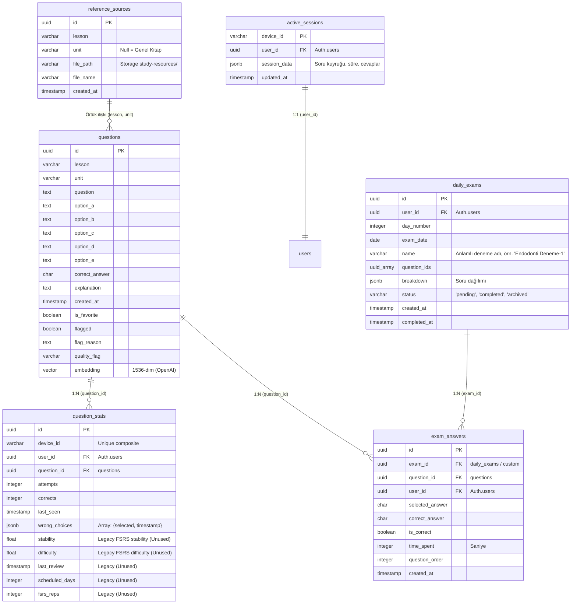

Bu dosya projenin teknik yapısını ve hiyerarşisini açıklamak amacıyla oluşturulmuştur ve her yapılan değişiklik sonrası ilgili kısım güncel versiyon ile güncellenir, built alınır ve deploy edilir.

# DUSBANKASI — Teknik Mimarisi & Kod Hiyerarşisi (v4.0)

Bu belge, DUSBANKASI projesinin tüm kod yapısını, veri tabanı şemasını, algoritmalarını ve veri akışlarını içeren bağlayıcı tek teknik kılavuzdur. LLM ve PAI ajanlarının sistemi sıfır hata ile anlaması, debug etmesi ve genişletmesi için tasarlanmıştır.

> **Ajan, bu projede ilk olarak bu dosyayı okur.** İnsan-odaklı tanıtım ve "proje ne yapar" sorusu için → [README.md](./README.md). Bu dosya "ne, nerede, hangi tetikleyicide hangi araç" sorusunun tek yetkili cevabıdır. Eski `CLAUDE.md` ve `AGENTS.md` kaldırıldı; içerikleri bu dosyaya ve README'ye taşındı.

---

## 0. TETİKLEYİCİ → ARAÇ HARİTASI (AJAN İLK BURAYA BAKAR)

Kullanıcı aşağıdaki komutları verdiğinde, ajan **tam olarak** şu aracı/dosyayı kullanır. Tahmin etme, bu tabloyu uygula.

| Kullanıcı der ki | Ne yapılır | Birincil araç / komut | Detay |
|---|---|---|---|
| "notebooklm ile soru üret/oluştur", "X ünitesi için exhaustive soru çıkar" | Çapa=Soru üretim motorunu çalıştır | `python scripts/notebooklm-exhaust.py --file "<pdf>" --lesson "<Ders>" --unit "<Ünite>"` | §4.1 |
| "şu klasördeki/şu PDF'lerden soru üret", "bu üniteleri sırayla işle" | Klasör / tek / çoklu PDF hedefini sırayla işle (her ünite sonunda ünite-kapsamlı denetim) | `python scripts/notebooklm-exhaust.py --input "<klasör veya pdf(ler)>" --lesson "<Ders>" --audit` | §4.1 |
| "notebooklm oturumunu canlı tut", "login düşmesin / kopmasın" | Oturumu periyodik tazele (kalıcı profilden) | `python scripts/session_keeper.py --once` (tek sefer) · zamanlanmış görev "NotebookLM Session Keeper" 2 saatte bir çalışır | §4.1 |
| "şu dosyadaki soruları ekle", "bu json/csv/md'yi yükle" | Hazır dosyadan **ajan-bağımsız** toplu ekleme | `python scripts/add_questions.py "<dosya>" [--lesson "<D>"] [--unit "<Ü>"] [--dry-run] [--audit]` | §4.5 |
| "soru ekle" (ham/dağınık serbest metin) | Ham metni kanonik JSON'a çevir → kalite kapısı → deploy | Workflow: `.agent/workflows/soru_ekle.md` (dönüşüm sonrası `add_questions.py` veya `shared.deploy_to_supabase`) | §5.5 |
| "ölüm maçı", "kalite kontrol/denetim yap", "X ünitesindeki kopyaları temizle" | Semantik kopya denetimi (LSH + cosine + DeepSeek-v4-pro) | `python scripts/tools/smart_audit_pipeline.py --lesson "<D>" [--unit "<Ü>"] [--dry-run] [--concurrency 8]` | §4.3 |
| "deneme oluştur", "bugün şu konulardan N soruluk deneme hazırla" | `daily_exams` tablosuna sınav yaz (Supabase MCP/REST ile) | Workflow: `WORKFLOW_GUNUN_DENEMESI.md` — SQL şablonları + `::uuid[]` cast zorunlu | §2, §5.3 |
| "deneme bitti", "hatalarımı analiz et", "tekrar raporu üret" | Bugünkü yanlışlar için RAG akademik tekrar raporu | `python scripts/generate_deneme_rag_reports.py [--limit N] [--dry-run]` | §4.4 + `WORKFLOW_DENEME_ANALIZI_RAG.md` |
| "üretimi geri al", "şu partiyi/dersi sil" | Parti geri alma — **önce daima --dry-run** | `python scripts/tools/batch_rollback.py --dry-run --lesson "<D>" --since <tarih>` | §4.2 |
| "DB'de kaç soru var", "ders dağılımını göster" | DB soru sayısı/dağılımı | `python scripts/tools/check_db_all.py` | — |
| "PDF'i böl", "kitabı ünitelere ayır" | PDF'i ~25 sayfalık dilimlere böl | `python scripts/tools/split_pdf_auto.py` | §4.1 |
| "embedding eksik/doldur" | Embeddingsiz satırlara 1536-dim embedding yaz | `python scripts/tools/backfill_embeddings.py` | §4.2 |

**Aktif dersler (exact, büyük/küçük harf duyarlı):** `Endodonti` · `Fizyoloji` · `Histoloji` · `Patoloji` · `Periodontoloji` · `Protez` · `Radyoloji`. `lesson`/`unit` değerleri **asla AI'a ürettirilmez** — script parametresi olarak geçilir veya DB'den ILIKE ile doğrulanır.

### Mutlak Yasaklar (hızlı liste — gerekçeler §3.3 ve §5.2'de)
1. Frontend'de **lazy-load** ekleme — açılışta `fetchQuestions()` TÜM soruları yükler (denenmiş, sorular görünmediği için kalıcı yasak).
2. Supabase `.or()` içinde **`not.in`** kullanma — sorgu motorunu kilitler. Pozitif desen + client-side `EXCLUDED_FLAGS` kullan.
3. `explanation` alanına **motivasyonel/dolgu cümlesi** ("Tebrikler!", "Unutmayın") yazma — kalite kapısı reddeder.
4. `batch_rollback.py`'yi **`--dry-run` olmadan** çalıştırma.
5. Python toplu yazımı **`_SUPABASE_WRITE_CHUNK=10`** ile yap — 100+ embedding tek seferde HTTP 500 verir.
6. Yeni bağımlılık / Zustand / global state ekleme — tüm state `App.tsx` State Machine'inde.

### Operasyonel Klasörler (silme/temizleme)
- `scripts/logs/` → `exhaust_*.txt` batch logları — **DEĞERLİ, silme** (kapsanmamış kavram & üretim izi).
- `scripts/recovery/pending/` → Supabase'e yazılmayı bekleyen checkpoint'ler (HTTP 200 sonrası silinir).
- `scripts/recovery/rejected/` → kalite kapısını geçemeyen sorular (sebep loglu).
- `scripts/recovery/raw/` → parse edilemeyen ham AI yanıtı (elle kurtarılabilir).
- `raporlar/curation_summary.md` → son Ölüm Maçı çıktısı (her çift: skor + karar + tam metin).

### 🔒 GÖREV SONRASI PROTOKOL (KESİN KURAL — İSTİSNASIZ)

Bir görev/değişiklik **tamamlandığında**, ajan şu üç adımı sırayla ve istisnasız uygular:

1. **Belgele:** Yapılan değişiklikleri ilgili bölümlere işle — insan-odaklı olanı `README.md`, teknik/operasyonel olanı `gemini.md`. (İki dosya da tek doğruluk kaynağıdır; güncel kalmaları zorunludur.)
2. **Build al:** `npm run build` — TypeScript hatası varsa görev **bitmemiş** sayılır; önce hatalar giderilir.
3. **Deploy et:** Vercel'e dağıt (`gsaslan2001-blip/xxq` → https://odusbircanavari.vercel.app). Push sonrası otomatik deploy tetiklenir; manuel ise `vercel --prod`.

> Bu protokol yalnızca frontend/uygulama davranışını değiştiren işlerde build+deploy gerektirir. Yalnızca Python pipeline'ı veya belge değişen işlerde adım 2-3 atlanabilir, ancak **adım 1 (README + gemini.md güncellemesi) her durumda zorunludur.**

---

## 1. GENEL MİMARİ VE BİLEŞEN HİYERARŞİSİ

Proje, **React 19 + TypeScript + Vite 8 + Tailwind CSS 4** tabanlı bir frontend istemcisi ve **Supabase (PostgreSQL + pgvector)** tabanlı bir sunucusuz (serverless) backend mimarisinden oluşur. Soru üretimi ve veri kalitesi güvencesi (QA) ise **Python 3.12 + Google NotebookLM API + OpenAI Embeddings** tabanlı bir veri hattı ile sağlanır.

### Kuşbakışı Dizin Haritası

```
DUSBANKASI/
├── public/                 # Statik varlıklar (resimler vb.)
├── raporlar/               # smart_audit_pipeline.py tarafından üretilen kopya raporları
├── scripts/                # Soru üretim, kürasyon ve deneme-analizi veri hattı (Python)
│   ├── tools/              # Kalite denetimi, embedding backfill ve veri kurtarma araçları
│   ├── lib/                # Asenkron servis sarmalayıcıları (RAG pipeline çekirdeği)
│   │   ├── db_layer.py         # Asenkron DB katmanı (aiohttp + Semaphore(10))
│   │   ├── lsh_matcher.py      # MinHash LSH deduplication O(log N)
│   │   ├── pinecone_client.py  # Async Pinecone wrapper + global fallback
│   │   ├── openai_client.py    # Async OpenAI wrapper + retry/backoff + 429 handler
│   │   └── progress_sync.py    # DUS/PROGRESS.md otomatik güncelleyici
│   ├── templates/          # LLM prompt şablonları (Jinja2)
│   │   └── s5_prompt.jinja2    # S5 v9.0 deneme-analizi sistem promptu
│   ├── config.py           # Python scriptlerinin konfigürasyon dosyası (absolute path + RAG sabitleri)
│   ├── notebooklm-exhaust.py # Çapa=Soru tabanlı ana üretim motoru (preflight + --audit)
│   ├── add_questions.py    # ⭐ Dosyadan (JSON/CSV/MD) ajan-bağımsız toplu soru ekleme CLI
│   ├── run_production.py   # Tüm dersleri sırayla işleyen orkestratör
│   ├── session_keeper.py   # NotebookLM oturum canlı tutma (LIB_PATH bootstrap'lı; --once / döngü)
│   ├── run_session_keeper.bat # Zamanlanmış görev launcher'ı (session_keeper.py --once + log)
│   ├── analyze_deneme_followup.py    # Supabase hata çekici (UTC-aware, dedup, null-guard)
│   ├── generate_deneme_rag_reports.py # ⭐ Deneme-analizi RAG orkestratörü (async)
│   └── shared.py           # Kalite filtreleri, JSON kurtarma ve DB yardımcıları (chunk retry + raw dump)
├── supabase/               # Supabase Edge Functions (Deno runtime)
│   ├── config.toml         # project_id + fonksiyon ayarları (manage-questions: verify_jwt=false)
│   └── functions/
│       └── manage-questions/index.ts # ⭐ App soru-ekleme backend'i: kalite filtresi + embedding + insert
├── src/                    # Frontend uygulama kaynak kodları (React + TS)
│   ├── components/         # Arayüz bileşenleri
│   │   ├── admin/          # Yönetimsel arayüzler
│   │   │   └── AddQuestionView.tsx # ⭐ Uygulama içi "Soru Ekle" formu (tekil + toplu JSON)
│   │   ├── ai/             # AI Asistan paneli
│   │   ├── quiz/           # Soru çözme ve quiz yönetim arayüzleri
│   │   ├── DailyPlanView.tsx # Günlük adaptif çalışma planı ve zayıf ünite metrikleri
│   │   ├── ErrorAnalyticsView.tsx # Hata sıklığı ve zayıf ünite analizi
│   │   ├── SimulationResultView.tsx # Sınav simülasyonu sonuç ekranı
│   │   └── SourceBooksView.tsx # AI referans PDF kitapları yönetim arayüzü
│   ├── config/             # Uygulama varsayılan ayarları (Adaptif ağırlıklar)
│   ├── hooks/              # Optimizasyon ve veri yönetim sarmalayıcıları (hooks)
│   ├── lib/                # Temel algoritmalar ve API istemcileri
│   │   ├── adaptive.ts     # Sinyal birleştirme, interleaving ve havuz planlama motoru
│   │   ├── ai.ts           # Gemini / DeepSeek API entegrasyon katmanı
│   │   └── supabase.ts     # Supabase istemcisi, full-fetch (TÜM sorular) ve cloud sync
│   ├── types/              # Evrensel TypeScript veri tipleri
│   ├── App.tsx             # Ana uygulama durum makinesi (State Machine)
│   ├── index.css           # Tailwind CSS 4 giriş noktası
│   └── main.tsx            # React 19 başlatıcı script
├── supabase-schema.sql     # Supabase ana veri tabanı tabloları ve RLS şeması
├── migration-v2-auth.sql   # Supabase Auth entegrasyonu ve pg_cron görevleri
├── package.json            # Bağımlılıklar ve npm scriptleri
├── tsconfig.json           # TypeScript derleyici konfigürasyonu
└── vite.config.ts          # Vite derleme ayarları
```

---

## 2. VERİTABANI ŞEMASI VE İLİŞKİSEL MİMARİ

Supabase PostgreSQL üzerinde koşan şema, öğrenim durumu takibi ve soru yönetimi için tasarlanmıştır.



### Kritik Alan Açıklamaları ve Kısıtlamalar

1. **`questions.quality_flag`**: Kalite denetiminden geçen veya kalan soruları işaretler.
   - `null` veya `'reviewed_keep'`: Çalışma havuzuna dahil edilir.
   - `'kavramsal_kopya'`: Post-production LSH denetiminde kopya bulunan sorulardır. Client-side filtre ile anında gizlenir.
   - `'auto_deleted'`: Her Pazar koşan `pg_cron` ile kalıcı olarak silinmek üzere bekletilen kayıtlar.
2. **`question_stats` Composite Unique Key**:
   - Tabloda `device_id` ve `question_id` üzerinde `UNIQUE` constraint vardır.
   - **Kritik Fix (v2.0)**: Eski şemada `user_id, question_id` üzerinden yapılan kısıt, anonim çalışan cihazların veri senkronizasyonunu bozuyordu. Artık her veri her zaman `device_id` ile yazılır, kullanıcı giriş yaptığında `user_id` alanı doldurulur ve bulut üzerinden cihaz bağımsız senkronizasyon tetiklenir.
   - **Kritik Fix (v3.1) — `user_id` Ezme Yarışı**: `pushStatsToCloud` (`src/lib/supabase.ts`) artık `user_id`'yi yalnızca giriş yapılmışsa payload'a ekler. `userId` yoksa alan tamamen dışarıda bırakılır; PostgREST `merge-duplicates` conflict update'inde sadece gönderilen sütunları yazdığı için mevcut `user_id` korunur. Aksi halde auth çözülmeden çalışan debounced sync, mevcut kayıtların `user_id`'sini `null`'a ezerek giriş yapan kullanıcının istatistiklerini yetim bırakıyordu. Regresyon testi: `src/lib/__tests__/supabase.test.ts`.

### Kritik RPC Fonksiyonları

| Fonksiyon | Görev |
|---|---|
| `match_questions_semantic(query_embedding, match_threshold, match_count, p_lesson)` | Verilen embedding'e semantik olarak en yakın soruları (opsiyonel ders filtresiyle) döndürür. |
| `match_questions_semantic_by_id(v_id, match_threshold, match_count)` | Bir sorunun embedding'ini referans alarak benzer soruları bulur (kopya tespiti). |
| `merge_device_stats_to_user(p_device_id, p_user_id)` | Login sonrası anonim cihaz istatistiklerini kullanıcı hesabına birleştirir. |

> `match_questions_semantic` tüm 10.768 satırda embedding mevcut olduğu için tam kapasite çalışır (backfill 2026-04-19'da tamamlandı).

### pg_cron Zamanlanmış Görevler (`migration-v2-auth.sql`)

| Zaman | Görev |
|---|---|
| Her gece 02:00 | 7 günden eski anonim (`user_id IS NULL`) `active_sessions` kayıtlarını sil. |
| Her Pazar 03:00 | 7 günden eski `quality_flag = 'kavramsal_kopya'` kayıtları `'auto_deleted'`'a geçir. |

> Anlık durum: ~166 `kavramsal_kopya` + ~4000 `auto_deleted`. Her ikisi de frontend'de client-side `EXCLUDED_FLAGS` Set'i ile gizlenir.

### `daily_exams` Supabase Fonksiyonları (`src/lib/supabase.ts`)

| Fonksiyon | Görev |
|---|---|
| `loadTodaysDailyExam(userId)` | Bugünün `pending` durumundaki sınavını getirir (bento kart bunu kullanır). |
| `saveDailyExam(userId, dayNumber, questionIds, breakdown)` | Atlas tarafından üretilen sınavı kaydeder. |
| `markDailyExamCompleted(examId)` | Sınav bitince `status='completed'` yapar (silme yok, arşivleme). |
| `getNextDayNumber(userId)` | Sıradaki gün numarasını hesaplar. |

> **Atlas-driven model:** `daily_exams` tablosunu manuel UI değil, Atlas (LLM) Supabase REST/MCP üzerinden doldurur. Kullanıcı sohbette konularını yazar → Atlas soruları seçip kaydeder → frontend açılışta `loadTodaysDailyExam()` ile otomatik yükler. Detaylı oyun kitabı: `WORKFLOW_GUNUN_DENEMESI.md`.

---

## 3. ALGORİTMALAR VE CORE KÜTÜPHANELER

### 3.1. FSRS-5 Tekrar Sistemi Devre Dışı Bırakıldı (Harici Anki Entegrasyonu)

Uygulamanın local FSRS spaced repetition durum makinesi ve `src/lib/fsrs.ts` modülü tamamen kaldırılmıştır. Kullanıcının aktif tekrar ve spaced repetition işlemlerini Anki (FSRS) gibi harici profesyonel bir ekosistemde yürütmesi nedeniyle, DUSBANKASI yalnızca akıllı soru bankası, performans analizi ve deneme/sınav simülasyonu rolünü üstlenecek şekilde optimize edilmiştir. 
* Local FSRS parametreleri (stability, difficulty, scheduled_days, fsrs_reps, last_review) frontend tiplerinden ve istatistik eşitleme akışlarından elenmiştir.
* Veritabanında (PostgreSQL) bu kolonlar geriye dönük uyumluluk adına fiziksel olarak korunmakta ancak uygulama tarafından güncellenmemektedir.

---

### 3.2. Adaptif Soru Seçim Motoru (`src/lib/adaptive.ts`)

Uygulamanın kalbi olan adaptif motor, soru havuzundan adayları seçerken 2 farklı sinyali birleştirerek bir öncelik kuyruğu (Priority Queue) oluşturur.

```
Sinyal 1: Weakness Score ──► [ (1-Accuracy)*0.7 + Wrong*0.3 ] ───┐
                                                               ├─► Ağırlıklı Toplam ─► + Jitter ─► Smart Queue
Sinyal 2: New Exploration ─► [ Random Exploration Priority ] ──┘
```

#### Öncelik Skoru (Priority Score) Hesaplama Formülü
Bir $q$ sorusu için toplam $Priority$ skoru $[0, 1]$ aralığına normalize edilir:
$$Priority = \text{Clamp}\Big(W_{weakness} \cdot Weakness(q), 0, 1\right) + \text{Jitter}$$
* **$Weakness(q)$**:
  $$Weakness = (1 - \text{CorrectRate}) \cdot 0.7 + \min\left(1, \frac{\text{WrongChoicesCount}}{10}\right) \cdot 0.3$$
  Çözülme geçmişinde sıkça yapılan yanlış seçimler weakness skorunu doğrudan yukarı taşır.
* **$New Exploration$ (Hiç görülmemiş sorular)**:
  Hiç çözülmemiş yeni sorular için doğrudan $W_{newExploration} \cdot \text{Math.random()}$ öncelik skoru atanarak havuz içinde homojen bir keşif önceliği sağlanır.
* **$Jitter$**: `Math.random() * 0.02` ile eklenen küçük gürültü. Aynı skora sahip soruların ardışık sıralanmasını engeller.
* **Ağırlık Kalibrasyonu**: `weakness: 0.70`, `newExploration: 0.30` varsayılan değerlerdir (`DEFAULT_ADAPTIVE_WEIGHTS`).
* **NOT**: FSRS vade ve gecikme (urgency) hesaplamaları local seviyede tamamen devre dışı bırakılmıştır.

#### Greedy Interleaving Algoritması
Rohrer & Taylor (2007) teorisine dayanan interleaving, ardışık gelen iki sorunun aynı dersten olmamasını hedefler.
1. Havuzdaki tüm sorular $Priority$ değerine göre büyükten küçüğe sıralanır.
2. Bir önceki seçilen sorunun dersi ($lastLesson$) hafızada tutulur.
3. Kalan listeden $lesson \neq lastLesson$ kuralına uyan en yüksek öncelikli soru seçilir (`sorted.findIndex(...)`).
4. Eğer listede farklı dersten soru kalmadıysa, en baştaki (aynı dersten olsa dahi) soru çekilerek havuz tamamlanır.

#### Soru Havuzu Kurucu Yardımcıları
* **`buildUnitQueue`**: Tek bir ünite bazında unseen (görülmemiş) soruları öne alır. Her bir grubu kendi içinde `fisherYates` algoritması ile karıştırır.
* **`buildSimulationPool`**: DUS simülasyonu için her dersten tam eşit sayıda soru seçer. Görülmemiş sorulara 2 kat ağırlık verir ve en son tüm listeyi global olarak karıştırır.
* **`buildDailyExam`**: Günün denemesi için **%80 hiç görülmemiş (New)** ve **%20 zor/orta/kolay (Review)** oranını hedefler. Review sorularında öncelik sırası `hard -> medium -> easy` şeklindedir.

---

### 3.3. Supabase Entegrasyonu ve Veri Yükleme (`src/lib/supabase.ts`)

> ## ⛔ KATİ KURAL — LAZY-LOAD KESİNLİKLE YASAK (İSTİSNASIZ)
> Uygulama **ilk açılışta `fetchQuestions()` ile TÜM soruları belleğe yükler.** Lazy-load
> (metadata + ders/ünite seçildiğinde dinamik çekim) mimarisi DENENMİŞ ve **kullanıcının
> soruları görememesine** yol açtığı için KALICI OLARAK kaldırılmıştır.
> **Yeniden eklenmesi YASAKTIR.** Adaptive motor (`buildSmartQueue`), simülasyon havuzu
> (`buildSimulationPool`), interleaving ve müfredat ilerleme hesabı (`getCurriculumProgress`)
> tamamı tüm soru havuzunun aynı anda bellekte olmasına bağımlıdır; kısmi yükleme bu
> hesapları bozar. `fetchQuestionMetadata` / `fetchQuestionsByUnit` fonksiyonları silinmiştir.

#### Tam Yükleme (Full-Fetch) Mimarisi
Açılışta `useQuestions().reload()` → `fetchQuestions()` çağrılır ve havuzun tamamı
`questions` state'ine yüklenir (App.tsx:204 startup `useEffect`).

```
İLK AÇILIŞ (App.tsx useEffect):
  loadQuestions() ──► fetchQuestions() ──► TÜM sorular (~6.600 görünür satır) belleğe
                                                │
                                                ▼
                          questions state ──► adaptive / simülasyon / quiz tümü buradan beslenir
```

#### Pagination ve Hata Toleranslı Paralel Fetching
Supabase API'sinin varsayılan 1000 satır sınırını aşmak için sorular `PAGE_SIZE=500`'lük
sayfalarla, her turda 2 sayfa paralel (`Promise.all`) ve `withRetry(3)` koruması altında çekilir:
```typescript
// fetchPage(from) + fetchPage(from + PAGE_SIZE) paralel → bir sayfa eksik (<500) gelene kadar döner
const [p1, p2] = await Promise.all([fetchPage(from), fetchPage(from + PAGE_SIZE)]);
// Timeout / 57014 hatalarında 1.2s, 2.4s backoff ile otomatik retry
```

#### Kritik Hata Çözümü: Supabase `.or()` Filtre Kısıtı
Supabase REST arayüzünde `not.in` filtrelerini `.or()` içinde birleştirmek, veritabanı sorgu motorunu kilitlemekte ve 5.000 sorudan sonra uygulamanın çökmesine yol açmaktaydı.
* **Hatalı Desen**: `q.or('quality_flag.is.null,quality_flag.not.in.(kavramsal_kopya,auto_deleted))'`
* **Doğru Desen (Fix)**: İzin verilen flag'ler pozitif olarak filtrelenir, reddedilenler ise client-side seviyesinde elenir:
  ```typescript
  q = q.or('quality_flag.is.null,quality_flag.eq.reviewed_keep');
  // Client-side yedek filtreleme
  const rows = data.filter(r => !EXCLUDED_FLAGS.has(r.quality_flag ?? ''));
  ```

---

## 4. PYTHON SORU ÜRETİM VERİ HATTI (PIPELINE)

Üretim veri hattı, ham PDF kaynak kitaplarını alıp bunları yüksek kaliteli DUS sorularına dönüştürmek ve Supabase'e yazmak üzere tasarlanmış 3 aşamalı bir otomasyon sistemidir.

### 4.1. Exhaustive Coverage Pipeline (`scripts/notebooklm-exhaust.py`)

Çapa=Soru (Anchor Mode v3) mimarisi üzerine kurulu üretim motorudur. Kaynaktaki bilgilerin doğrudan-kökte kapsanmasını hedefler.

#### Giriş Modları
* **`--file "<pdf>"`** — tek dosya (opsiyonel `--unit` ile ünite adı override edilir).
* **`--input <hedef...>`** — bir veya birden çok **PDF ve/veya klasör**. Klasör verilirse içindeki tüm `.pdf/.md` dosyaları **dosya adındaki sayıya göre doğal sıralı** (Ünite 1→2→…→10) ve sırayla işlenir. Her dosyada ünite = dosya adı. `--lesson` zorunlu. Üniteler arası `COOLDOWN_BETWEEN_UNITS` beklemesi + oturum tazeleme yapılır.
* **Kuyruk modu** — `QUEUE_<DERS>_DIR` ortam değişkenleriyle klasör kuyruğu (`--file`/`--input` yokken).

> Tipik tam akış: `python scripts/notebooklm-exhaust.py --input "<klasör>" --lesson "<Ders>" --audit` → her ünite için üret → embedding'le DB'ye yaz → **ünite-kapsamlı** Ölüm Maçı (mevcut sorularla kıyas; benzeri olmayan kalır, benzer çiftlerden DeepSeek-v4-pro kazananı seçer, zayıf flag'lenir).

#### Aşama 1: Google Playwright ile Otomatik Çerez Yönetimi
NotebookLM resmi olmayan API'si Google accounts çerezlerine ihtiyaç duyar.
1. `ensure_auth` fonksiyonu yerel depolamadaki çerezleri test eder.
2. Geçersizlik durumunda `_auto_refresh_cookies` fonksiyonu Playwright ile headless tarayıcıyı başlatır.
3. Yerel Google Chrome profilinden (`~/.notebooklm/profiles/default/browser_profile`) taze çerezleri çekerek `notebooklm-auth.json` dosyasına sessizce yazar. İnsan müdahalesi olmadan 7/24 çalışma sağlanır.

> **Dayanıklılık (preflight + taşınabilirlik):** `main()` artık üretime başlamadan önce `ensure_auth(client)`'ı çağırır; oturum geçersizse ünite ortasında değil **baştan** `sys.exit(1)` ile anlaşılır mesaj verir (`notebooklm login` gerekli). Ayrıca `config.LIB_PATH` artık `NOTEBOOKLM_LIB_PATH` ortam değişkeninden okunur (varsayılan: `…\Projeler\notebooklm-py-main\src`); yol mevcut değilse `notebooklm-exhaust.py` import anında net hata verir (makineye bağımlı sessiz `ImportError` yok). `--audit` bayrağı verilirse her ünite bittiğinde `run_audit(unit=<ünite>)` (**ünite-kapsamlı** Ölüm Maçı) otomatik tetiklenir — yeni sorular yalnızca o ünitedeki mevcut sorularla kıyaslanır.

> **Uzun ömürlü oturum (session_keeper):** NotebookLM'in Google çerezleri (özellikle rotasyonlu `__Secure-*PSIDTS`) profil haftalarca boşta kalırsa sunucu tarafında geçersizleşir. `scripts/session_keeper.py` kalıcı Playwright profilinden çerezi periyodik tazeleyerek bunu önler. Windows zamanlanmış görevi **"NotebookLM Session Keeper"** `run_session_keeper.bat`'i 2 saatte bir çalıştırır (log: `scripts/logs/session_keeper.log`). İlk kurulum için bir kez `notebooklm login` gerekir; sonrasında oturum kendini tazeler. `session_keeper.py` kütüphane yolunu (`config.LIB_PATH`) kendi `sys.path`'ine bootstrap eder.

#### Aşama 2: Çapalama (Faz 0)
Modele `PROMPT_ANCHOR` yönergesi gönderilerek PDF kaynak metni satır satır taratılır. Metindeki her bir bağımsız tıbbi kavram, sendrom, ilaç veya reseptör alt alta yazdırılarak bir kavram listesi (Anchors) elde edilir. Çıktının sonuna `TOPLAM_KAVRAM = <sayı>` ekletilerek bütünlük doğrulanır.

#### Aşama 3: Dilimleme ve Sıralı Soru Üretimi (Faz 2 & 3)
1. Yerel veritabanından ilgili ünitenin mevcut soruları çekilir.
2. Çekilen bu soruların **yalnızca kökleri** taranarak `classify_anchors` algoritması çalıştırılır.
   * **Çapa Eşleşme Mantığı (sıkı)**: Çapadaki kelimelerin (3+ karakterli anlamlı kelimeler) **%60'ından fazlası** mevcut soru **köklerinde** geçiyorsa o çapa "sorgulanmış" kabul edilir. **Açıklama (explanation) ve şıklar SAYILMAZ** — bir kavramın yalnızca açıklamada geçmesi onu "kapsandı" yapmaz. Bu, kapsam rakamını gerçeğe yaklaştırır (yalnızca açıklamada geçen kavramlar "kalan" sayılır ve doğrudan kökte sorulana dek yeni soru üretilir).
3. Kapsanmayan kavramlar 25'erli (`CHUNK_SIZE`) dilimlere bölünür.
4. Her dilim, NotebookLM üzerinde **YENİ bir conversation** oluşturularak gönderilir. Bu sayede modelin önceki yanıtlardan etkilenerek duplikasyon üretmesi engellenir.
5. Model her sorunun kökünü bu kavramlardan birine "çapalamak" zorundadır.

#### Aşama 4: Doygunluk (Saturation) Denetimi
Model ardışık 3 batch boyunca 0 soru dönerse veya yanıtta `DOYGUNLUK` kelimesi geçerse üretim durdurulur ve kalan tüm sorgulanmamış kavramlar `logs/uncovered_[UNIT].txt` dosyasına raporlanır.

---

### 4.2. Yapısal Kalite Kapısı (`scripts/shared.py`)

NotebookLM'den üretilen sorular Supabase'e yazılmadan önce `validate_question_batch` fonksiyonundan geçmek zorundadır. Yapısal kuralları ihlal eden sorular anında elenerek `recovery/rejected/` dizinine loglanır.

```
AI Çıktısı ──► [ partial_repair ] ──► [ Kalite Kapısı ] ──► Geçti ──► [ Yerel Checkpoint ] ──► Supabase'e Yaz
                                             │
                                             └──► Kaldı ─► [ rejected/ ]
```

#### Kalite Kapısı Filtre Kriterleri (`_validate_single_question`):
* **Filtre 1.a–1.c (Yapısal Bütünlük)**: A–E şıklarının tamamı string tipinde ve dolu olmalı. `correctAnswer` A–E aralığında olmalı. Soru kökü en az `MIN_STEM_WORDS` kelime.
* **Filtre 1.d (Açıklama Uzunluğu)**: Açıklama boş olamaz ve en az `MIN_EXPL_WORDS` (varsayılan 5) kelime içermelidir.
* **Filtre 1.e (AI Dolgu Cümlesi)**: Açıklamada "Tebrikler!", "Unutmayın", "Bu önemli" gibi `AI_FILLER_PHRASES` ifadelerinden biri geçiyorsa → `ai_dolgu_cumlesi` ile reddedilir.
* **Filtre 1.f (Mojibake / Bozuk Karakter)**: Soru kökü/açıklama/şıklarda `MOJIBAKE_SIGNATURES` (`Ã`, `ÅŸ`, `ı`…) bulunursa → `bozuk_karakter` ile reddedilir. **"periodontal", "dişeti" gibi geçerli tıbbi terimler etkilenmez.**
* **Filtre 3 (Bilgi Sızıntısı / Information Leakage)**: Doğru şıkkın anlamlı kelimelerinin **%60'ından fazlası** soru kökünde geçiyorsa "kolay elenebilir" sayılıp reddedilir.
  - Örnek: Soru kökünde "...tanısında altın standart yöntem hangisidir?" denip doğru şıkta "X yöntemi" yazması elenme sebebidir.
* **Filtre 4 (Tautological Explanation / Zayıf Açıklama)**: Açıklamanın anlamlı kelimelerinin **%60'ından fazlası** sadece soru kökünün tekrarından ibaretse "yeni bilgi öğretmeyen kalitesiz soru" olarak reddedilir.
  - Örnek: "X hastalığının tedavisinde Y ilacı kullanılır çünkü X hastalığında Y ilacı tercih edilmektedir." açıklaması anında elenir.

> `AI_FILLER_PHRASES` ve `MOJIBAKE_SIGNATURES` `config.py`'de merkezî olarak tanımlıdır; hem üretim kapısı (`shared.py`) hem Ölüm Maçı (`audit_logic.py`) aynı listeyi paylaşır.

#### Çökmeye Karşı Dayanıklılık (Fault Tolerance) & Checkpoint
* **Partial JSON Repair**: Ağ kesintisi veya token limiti nedeniyle yarım kalan (truncated) JSON çıktılarında, kapanmamış son objeyi tespit edip (`try_repair`) diziyi kapatarak sağlam soruları kurtarır.
* **Kayıpsız Ham Dökme (`_dump_raw_response`)**: `extract_json` hiçbir şey kurtaramazsa ham AI yanıtını `recovery/raw/unparsed_<ts>.txt` dosyasına döker; veri elle kurtarılabilir kalır (sessiz veri kaybı yok).
* **Yerel Checkpoint**: deployment öncesi doğrulanmış soruları `recovery/pending/` klasörüne zaman damgalı JSON olarak yazar. Supabase API HTTP 200 dönerse bu dosya silinir. Çökme durumunda `replay_pending_checkpoints()` ile veri kaybı sıfırlanır.
* **Chunked Batch Insert + Retry**: Büyük soru grupları gönderildiğinde Supabase'in HTTP 500 vermesini engellemek için sorular **10'arlı (`_SUPABASE_WRITE_CHUNK`) gruplar** halinde, aralarına 0.5 saniye bekleme koyularak veritabanına basılır. Her chunk POST'u geçici hatalarda (`classify_error` → `RetryableError`: 5xx/timeout) `2s→5s→12s` exponential backoff ile otomatik tekrar dener; kalıcı hatada (4xx) hemen vazgeçer ve checkpoint korunur — geçici ağ hatasında soru kaybı yaşanmaz.

---

### 4.3. Smart Audit Ölüm Maçı Pipeline (`scripts/tools/smart_audit_pipeline.py`)

Üretim turları tamamlandıktan sonra çalışan post-production aşamasıdır. Görevi, kavramsal kopyaları tespit etmek ve "Ölüm Maçı" mantığıyla zayıf soruları elemektir.

#### Aşama 1: Lexical + Semantic Hibrit Radar Taraması (`find_duplicates`)
* **LSH (Locally Sensitive Hashing)**: Soruların n-gram (kelime bazlı) benzerlikleri taranarak hızlıca potansiyel kopya çiftleri aday havuzuna alınır.
* **OpenAI Cosine Similarity**: Aday çiftlerin OpenAI embeddings (1536-dim) vektör çarpımları hesaplanır (`_semantic_pairs`). **numpy varsa** satır-normalize edilmiş matrisle bloklu (512'lik) vektörize çarpım C hızında yapılır; numpy yoksa norm'ları bir kez hesaplayan saf-Python yedeğine düşülür (eski sürüm her iç döngüde norm'u yeniden hesaplayıp binlerce soruda pratikte takılıyordu). Benzerlik **0.92+** → `kavramsal_kopya`, **0.85–0.92** → `borderline_kopya`.

#### Aşama 2: Koruyucu Filtreler (Guards — `curate_pairs`)
Karar vericiye gitmeden önce iki ucuz koruma çalışır; tetiklenirse **ikisi de korunur**:
* **`lexical_guard`**: İki soruda geçen tip/evre/sınıf/faz/grade numaraları farklıysa (ör. Tip 1 vs Tip 2) → farklı kavram.
* **`medical_contrast_guard`**: Biri zıt kavramı (hiper/hipo, maksiller/mandibular, akut/kronik, primer/sekonder…), diğeri karşıtını içeriyorsa → farklı kavram.
* **`stem_jaccard < 0.08`**: Soru kökleri leksikal olarak neredeyse hiç örtüşmüyorsa → farklı kavram.

#### Aşama 3: Ölüm Maçı Karar Verici — DeepSeek-v4-pro (`call_deepseek_decision`)
Koruyucuları geçen her şüpheli çift **DeepSeek-v4-pro**'ya gönderilir. Karar vericiye yalnızca **değerlendirilecek üçlü** iletilir: **soru kökü + DOĞRU şık + açıklama**. Çeldirici (yanlış) şıklar bilinçli olarak gönderilmez — amaç sorgulanmış bilginin tekrar sorgulanmasını önlemektir; aynı çeldiricinin birden çok soruda bulunması bilgi tekrarı sayılmaz ve kararı gereksiz yere etkilerdi. Rubrik (öncelik sırasıyla): sorgulanan bilgi aynı mı → klinik derinlik → açıklama öğreticiliği → Türkçe dil sağlığı → AI dolgu cümlesi mutlak elemesi.

Karar şu yapılandırılmış JSON şemasıyla döner:
```json
{ "verdict": "keep_1 | keep_2 | keep_both | remove_both", "confidence": 0.0-1.0, "reason": "..." }
```
* **keep_1 / keep_2** → güçlü soru korunur, zayıf kopya `quality_flag='kavramsal_kopya'` ile elenir.
* **keep_both** → sorular aslında farklı alt-kavram/tip/evre test ediyor → ikisi de korunur.
* **remove_both** → ikisi de tıbben hatalı/öğretici değil → ikisi de elenir.

**Yerel Yedek (`_local_verdict`):** `DEEPSEEK_API_KEY` yoksa veya API hata verirse, `calc_quality_score` tabanlı yapılandırılmış yedek devreye girer (yüksek puanlı kazanır; ikisi de `QUALITY_FLOOR` altındaysa `remove_both`). `calc_quality_score` artık klinik tanı/laboratuvar derinliği ve açıklama uzunluğunu ödüllendirir, AI dolgu cümlesini (−30) ve **yalnızca gerçek mojibake'yi** (−50) cezalandırır — eski sürümdeki `r"periodontal"` deseni her perio sorusunu haksızca eliyordu, **kaldırıldı**.

> Not: DUS'ta olumsuz soru kökü ("…değildir/yanlıştır") gerçek bir sınav formatıdır; `calc_quality_score` bunu cezalandırmaz, **+15 ödül** verir.

---

### 4.4. Deneme Analizi & RAG Otomasyonu (`scripts/generate_deneme_rag_reports.py`)

Deneme sınavı bittikten sonra çalışan, kullanıcının yanlışları için akademik tekrar raporu üreten asenkron RAG (Retrieval-Augmented Generation) hattıdır. Tam oyun kitabı: `WORKFLOW_DENEME_ANALIZI_RAG.md`.

#### Tam Akış

```
Supabase (question_stats)
    │  bugünkü yanlışlar — UTC timestamp, wrong_choices null-guard, question_id dedup
    ▼
analyze_deneme_followup.get_today_mistakes(detailed=True)
    │  lesson / unit / question_text / question_id
    ▼
asyncio.gather (Semaphore=3)  ←── her hata izole try/except içinde
    │
    ├── pinecone_client.get_rag_context()
    │       index: myppdfs | namespace: lesson.lower() | top_k=15
    │       rerank: bge-reranker-v2-m3 → top_n=5
    │       boş namespace → namespace'siz global fallback
    │
    ├── openai_client.generate_completion()
    │       model: gpt-4o | temperature: 0.3
    │       retry: 3× | backoff: 1s→2s→4s | HTTP 429 → 60s bekle
    │
    └── .md dosyası →
        C:\Users\FURKAN\Desktop\DUS\Deneme Analizi\Tekrar Hataları\YYYY-MM-DD\
        [Ders]_[Unite]_[QID_ilk8].md   (Türkçe karakter: ş→s, ğ→g, ü→u, ç→c, ı→i, ö→o)
    ▼
progress_sync.update_progress()
    └── C:\Users\FURKAN\.claude\DUS\PROGRESS.md → "Tamamlanan Deneme Analizleri"
```

#### Pinecone Parametre Referansı

| Parametre | Değer | Açıklama |
|---|---|---|
| `index` | `myppdfs` | Akademik kaynak PDF vektör indeksi |
| `namespace` | `lesson.lower()` | Ders bazlı bölümleme (radyoloji, patoloji…) |
| `top_k` | 15 | İlk arama sonuç sayısı |
| `rerank model` | `bge-reranker-v2-m3` | Çapraz-kodlayıcı yeniden sıralama |
| `top_n` | 5 | Rerank sonrası LLM'e giden parça sayısı |
| `fallback` | namespace kaldır | Namespace boş → global indeks araması; hâlâ boşsa context = "İlgili kaynak bulunamadı." |

`MYPPDFS_HOST` ve `PINECONE_API_KEY` değerleri `.env.local`'da tanımlıdır; `config.py` bunları absolute `Path(__file__)` referansıyla yükler (farklı dizinden çalıştırmak güvenlidir).

#### S5 v9.0 Sistem Promptu (`scripts/templates/s5_prompt.jinja2`)

Jinja2 şablonu; değişkenler: `{{ context }}`, `{{ lesson }}`, `{{ unit }}`, `{{ question_text }}`.

* **Mutlak Yasaklar:** Kısa yanıt yasağı · Belirsizlik yasağı ("vb.", "gibi", "vs." yerine tüm elemanları açıkça yaz) · Mekanizma şartı (min 3 basamaklı `[Tetikleyici] → [Ara 1] → [Ara 2] → [Sonuç]` zinciri) · Tablo şartı (min 1 Markdown karşılaştırma tablosu) · Kesin sayı şartı ("yüksek oranda" yerine tam sayı).
* **Rapor Bölümleri:**
  1. **HIGH-YIELD 20/80 ÖZÜ** — Patognomonik + ayırt edici bilgiler, mekanistik numaralı liste.
  2. **KAPSAMLI KONU ANLATIMI** — 8 alt başlık (Tanım, Etyoloji, Patogenez, Klinik, Radyoloji/Lab, Tedavi, Karşılaştırma Tablosu, DUS Tuzakları).
  3. **5 KLASİK DUS SORUSU** — 5 şıklı, doğru cevap + 3+ basamaklı mekanizma + her yanlış şıkkın eliminasyonu.

#### Hata Dayanıklılığı

| Senaryo | Davranış |
|---|---|
| Pinecone namespace boş | Global fallback; hâlâ boşsa context = "İlgili kaynak bulunamadı." |
| OpenAI HTTP 429 | 60s bekle, 3 deneme; tükenirse o rapor atlanır, diğerleri devam eder |
| OpenAI geçici hata | 1s → 2s → 4s exponential backoff, 3 deneme |
| Supabase join None | O kayıt loglanıp sessizce atlanır |
| Herhangi bir istisna | İzole try/except — pipeline çökmez, sonraki hataya geçer |

#### Çalıştırma Komutları

```powershell
python scripts/generate_deneme_rag_reports.py            # Bugünkü tüm yanlışlar
python scripts/generate_deneme_rag_reports.py --limit 3  # İlk 3 (API kredisi harcamadan test)
python scripts/generate_deneme_rag_reports.py --dry-run  # Listele, rapor üretme
```

---

### 4.5. Dosyadan Toplu Soru Ekleme CLI (`scripts/add_questions.py`)

Atlas/LLM'e bağlı olmadan, hazır bir dosyadan soru eklemenin deterministik yolu. Mevcut `shared.validate_question_batch` ve `deploy_to_supabase` fonksiyonlarını **yeniden kullanan ince bir sarmalayıcıdır** — yeni iş mantığı içermez.

#### Girdi Formatları ve Normalizasyon
* **`.json`** — kanonik liste `[{question, options{A..E}, correctAnswer, explanation, lesson, unit}]` veya `{ "questions": [...] }` zarfı. Düz `option_a..option_e` / `correct_answer` anahtarları da kabul edilir (esnek `_normalize_one`).
* **`.csv`** — başlık satırı `lesson,unit,question,option_a..option_e,correct_answer,explanation` (utf-8-sig BOM toleranslı).
* **`.md`** — `### Soru N` / `**Soru Metni:**` / `- A) …` / `**Doğru Cevap:** A` / `**Soru Açıklaması:**` blok formatı (eski `manual_upload_md` mantığının sağlamlaştırılmış hâli).

> **Ham NotebookLM çıktısı kurtarma:** `.json` dosyası düz `json.loads` ile parse edilemezse VEYA `.md/.txt` blok formatı bulunamazsa, içerik `shared.extract_json` ile kurtarılır — NotebookLM'in ürettiği `<analiz>…</analiz>` + ```json fence sarmalı ham çıktı **doğrudan** içe aktarılabilir (elle temizlik gerekmez).

#### Akış
```
dosya ──► load_questions() ──► _normalize_one() (kanonik şema)
      ──► lesson/unit doldur (satır değeri > --lesson/--unit bayrağı)
      ──► (lesson,unit) bazında grupla
      ──► her grup: validate_question_batch() ──► [--dry-run? rapor : deploy_to_supabase()]
      ──► [--audit? deploy edilen her (ders,ünite) için smart_audit_pipeline.py --unit --dry-run önizleme]
```

#### CLI Argümanları
| Argüman | Görev |
|---|---|
| `dosya` (pozisyonel) | `.json` / `.csv` / `.md` soru dosyası |
| `--lesson` / `--unit` | Dosyada satır-bazında yoksa varsayılan ders/ünite |
| `--dry-run` | Yalnız doğrula + kabul/ret raporu; Supabase'e yazma yok |
| `--audit` | Bitince deploy edilen her **(ders, ünite)** için **ünite-kapsamlı** Ölüm Maçı önizlemesi tetikle (`--unit`) |

> Kalite kapısı üretim hattıyla **birebir aynıdır** (`_validate_single_question`). Reddedilenler `recovery/rejected/`'a loglanır; embedding üretimi ve chunked-write `deploy_to_supabase` içinde olduğu gibi korunur (§4.2).

---

### 4.6. Veri Tutarsızlığı Düzeltme (Pipeline Yan Etkisi)

Pipeline bazen soruları **yanlış `lesson`/`unit`** altına yazabilir (PDF dilimi karışması, isim çakışması). Böyle bir durumu fark edersen Supabase SQL ile `UPDATE` pattern'i uygula. Geçmişte çözülmüş örnekler:

```sql
-- 1. Yanlış derse kaydolmuş üniteleri taşı (Histoloji'ye düşmüş Periodontoloji üniteleri örneği)
UPDATE questions SET lesson = 'Periodontoloji'
WHERE lesson = 'Histoloji'
  AND unit IN ('2.C)Etiyoloji','3.a - Gingival Hastalıklar',
               '6.b - Cerrahi Teknikler 1','6.c - Cerrahi Teknikler 2',
               '7.b - İleri Cerrahi İşlemler 2');

-- 2. Aynı kavramın iki farklı ünite-isim formatını tekilleştir (isim çakışması)
UPDATE questions
SET unit = 'Ünite 2 - KÖK KANAL ANATOMİSİ ve GİRİŞ KAVİTESİ PREPARASYONU'
WHERE lesson = 'Endodonti' AND unit = 'Ünite 2 - KÖK KANAL ANATOMİSİ';
```

> Kural: `lesson`/`unit` daima projedeki **exact** isimlendirmeye (§0 aktif dersler) çekilir. Düzeltme öncesi `SELECT lesson, unit, COUNT(*)` ile etkilenen satır sayısını doğrula.

---

## 5. APP ENTEGRASYON VE STATE FLOW

Frontend tarafında veri akışı son derece sıkı kurallarla korunmaktadır.

```
               [ Supabase DB ]
                      ▲
                      │  (Full-Fetch — açılışta TÜM sorular belleğe; LAZY-LOAD YASAK)
                      ▼
[ App.tsx (State Machine) ] ──► [ useQuestions hook ] ──► [ UI Components ]
         │
         ├──► [ useResumableSession ] ──► [ LocalStorage & Cloud Active Session ]
         └──► [ adaptive.ts ] ──────────► [ Akıllı Soru Seçimi ]
```

### 5.1. useResumableSession Hook (`src/hooks/useResumableSession.ts`)
Furkan soru çözerken tarayıcı kapansa veya bağlantı kopsa dahi kaldığı yeri kaybetmemelidir.
* **Çift Katmanlı Koruma**: Oturum durumu her soru işaretlendiğinde anlık olarak hem `localStorage`'a yazılır hem de debounced olarak cloud'daki `active_sessions` tablosuna post edilir.
* **Debounce Fix (v3.1)**: `saveResumableSession` sayacı (`saveCountRef`) artık monoton ilerler — 1, 6, 11... kaydında anında cloud flush, aradakiler 3sn debounce. Önceki sürüm her flush sonrası sayacı `0`'a sıfırlıyordu; bu da `% 5 === 1` modulosunu daima `1` yapıp **her cevapta** anlık yazma tetikleyerek debounce'u tamamen devre dışı bırakıyordu (gereksiz ağ yükü). Sayaç yalnızca oturum bittiğinde/temizlendiğinde sıfırlanır, böylece yeni oturumun ilk cevabı yine anında yedeklenir. Tarayıcı kapanışında `beforeunload` + `keepalive` fetch bekleyen kaydı garantiler.
* **Kurtarma Akışı**: Uygulama açıldığında cihaz kimliği (`device_id`) veya kullanıcı UUID'si ile buluttan son aktif oturum aranır. Bulunursa kullanıcıya "Kaldığın yerden devam etmek ister misin?" uyarısı çıkarılarak state kaldığı adıma restore edilir.

### 5.2. Ajanlar İçin Kod Değiştirme ve Geliştirme Protokolü
Uygulama üzerinde çalışırken aşağıdaki üç kural asla ihlal edilemez:
1. **Zustand veya global state kütüphanesi eklemek yasaktır**. Tüm arayüz ve oyun motoru state'i `App.tsx` içerisindeki ana State Machine üzerinden yönetilir.
2. **Yeni bağımlılık eklemek yasaktır**. Sadece mevcut paketler (Tailwind 4, React 19, Lucide, Supabase JS, pdfJS) kullanılacaktır.
3. **RLS Bypass Kuralı**: frontend istemcisi anonim anahtarla çalıştığı için doğrudan yazma (`INSERT`, `UPDATE`) yetkisine sahip değildir. Tüm veri yazma operasyonları API katmanı üzerinden veya backend entegrasyonu ile yapılmalıdır.
4. **Lazy-Load eklemek YASAKTIR**. Uygulama açılışta `fetchQuestions()` ile tüm soruları yükler (bkz. §3.3). Metadata-önce / ünite-bazlı dinamik çekim denenmiş ve sorular görünmediği için kalıcı olarak yasaklanmıştır.
5. **Supabase `.or()` içinde `not.in` kullanmak YASAKTIR** — sorgu motorunu kilitler. Pozitif desen (`quality_flag.is.null,quality_flag.eq.reviewed_keep`) + client-side `EXCLUDED_FLAGS` filtresi kullanılır.
6. **Python toplu yazma `_SUPABASE_WRITE_CHUNK=10`** ile 10'arlı, 0.5sn cooldown'lu yapılır; tek seferde 100+ embedding HTTP 500 verir. AI çıktısındaki `q["lesson"]`/`q["unit"]` ASLA okunmaz — script parametresi set edilir.

### 5.3. AppState Durum Makinesi ve Çalışma Modları (`src/App.tsx`)

Tüm UI ve oyun motoru state'i `App.tsx` içindeki tek State Machine üzerinden yönetilir. Ana modlar:

```
select-lesson → select-unit → quiz
             → select-deneme → select-deneme-amount → exam
             → simulation | analytics | error-analysis | daily-plan | source-books
             → import (ham JSON) | add-question (Soru Ekle formu)
```

Bento kart durumları (`dailyExamStatus`): `no-user` (giriş yok) · `not-ready` (Atlas henüz hazırlamadı) · `ready` ("N. Günün Denemesi · X Soru · Başlatmak için tıkla").

> **Not:** `DailyExamSetup` UI komponenti ve `daily-exam-setup` AppState kaldırıldı (Atlas-driven modele geçiş, 2026-05-11).

### 5.4. Deneme Bazlı Soru Takibi (`exam_answers`)

Bir deneme tamamlandığında `handleComplete()` her sorunun cevabını `exam_answers` tablosuna yazar (`exam_id`, `question_id`, `selected_answer`, `is_correct`, `time_spent`, `question_order`). Bu sayede deneme-sonrası analiz sorguları mümkün olur:

```sql
-- "Endodonti Deneme-1'de yanlış yaptıklarım"
SELECT q.*, ea.selected_answer, ea.correct_answer
FROM exam_answers ea
JOIN questions q  ON q.id = ea.question_id
JOIN daily_exams de ON de.id = ea.exam_id
WHERE de.name = 'Endodonti Deneme-1'
  AND ea.user_id = '<user_id>' AND ea.is_correct = false;
```

Bu yanlışlar, §4.4'teki RAG pipeline'ın girdisini oluşturur (`analyze_deneme_followup.get_today_mistakes`).

### 5.5. Manuel Soru Ekleme Protokolü (`/soru-ekle`)

Kullanıcının ilettiği ham soruları DUSBANKASI'na aktarma akışı (`.agent/workflows/soru_ekle.md`):

1. **Format Dönüşümü:** Ham metin/dosya → standart JSON şeması (`question`, `options{A..E}`, `correctAnswer`, `explanation`, `lesson`, `unit`).
2. **🛑 Kalite Gate (zorunlu):** Soru metni tam mı · 5 şık (A-E) dolu ve anlamlı mı · doğru cevap atanmış mı · `explanation` dolu mu · `lesson`/`unit` tanımlı mı. Geçemeyen → kullanıcıya hata raporu + düzeltme isteği.
3. **Deploy:** `shared.deploy_to_supabase` (OpenAI 1536-dim embedding + 10'arlık chunked write). Sonrasında toplam soru sayısı doğrulanır.

`lesson`/`unit` isimleri her zaman projedeki standart isimlendirmeye (Aktif dersler: Endodonti · Fizyoloji · Histoloji · Patoloji · Periodontoloji · Protez · Radyoloji) uymalıdır.

> **Birincil yol artık ajan-bağımsızdır:** §4.5'teki `add_questions.py` CLI (terminal) veya §5.6'daki uygulama içi "Soru Ekle" formu kullanılır. Atlas yalnızca serbest-biçimli ham metni kanonik JSON'a çevirmek gerektiğinde devreye girer.

### 5.6. Uygulama İçi Soru Ekleme + `manage-questions` Edge Function

Eskiden `importQuestions` doğrudan `supabase.from('questions').insert(...)` çağırıyordu — **kalite filtresi ve embedding yoktu**, dolayısıyla uygulamadan eklenen sorular `match_questions_semantic` ve Ölüm Maçı'nda görünmez kalıyordu. Bu yol kapatıldı; tüm uygulama eklemeleri artık bir Supabase Edge Function üzerinden geçer.

#### Akış
```
AddQuestionView (tekil form / toplu JSON)
   │  ImportQuestion[]
   ▼
supabase.functions.invoke('manage-questions', { body: { questions } })   (src/lib/supabase.ts → addQuestions)
   ▼
Edge Function (Deno · supabase/functions/manage-questions/index.ts)
   ├── validateOne()  ── scripts/shared.py::_validate_single_question ile BİREBİR (eşikler, stopword'ler, mojibake, sızıntı/totoloji %60)
   ├── OpenAI text-embedding-3-small (1536-dim)  ── anahtar yalnız Edge secret OPENAI_API_KEY'de
   └── questions tablosuna 10'arlık chunked insert (service_role → RLS bypass)
   ▼
{ accepted, written, rejected: [{index, reason}] }   ── form reddedilenleri satır-bazında gösterir
```

* **`src/lib/supabase.ts`**: `addQuestions(questions)` Edge Function'ı çağırır ve tipli `AddQuestionsResult` döndürür. Geriye uyumluluk için `importQuestions` artık `addQuestions`'a delege eder (eski `ImportView` çalışmaya devam eder).
* **`verify_jwt=false`** (`supabase/config.toml`): Fonksiyon kendi girdi doğrulamasını yapar ve uygulama anon key ile çağırır (questions tablosu zaten public). Deploy: Supabase MCP `deploy_edge_function` veya `npx supabase functions deploy manage-questions`.
* **Secret bağımlılığı**: `OPENAI_API_KEY` Edge secret olarak ayarlı değilse fonksiyon yine **doğrular ve yazar**, fakat embedding üretmez (graceful fallback; loglar). Embeddingsiz satırlar `scripts/tools/backfill_embeddings.py` ile sonradan doldurulabilir.
* **Filtre paritesi riski**: Kalite kuralları iki dilde yaşar (Python `shared.py` + Deno `index.ts`). Eşik değişirse ikisi elle eşitlenmelidir.

---
**DUSBANKASI — TEKNİK YÖNERGE v4.3 — SON GÜNCELLEME: 2026-05-26**
*Bu dosya ajanın ilk okuduğu tek yetkili teknik kaynaktır. CLAUDE.md ve AGENTS.md birleştirildi/kaldırıldı.*
